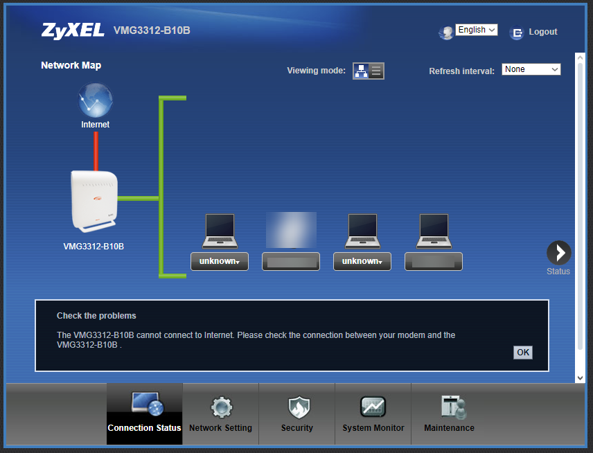

# Python ile Zyxel ADSL Modem (VMG3312 serisi) yeniden başlatma betiği

Bu belge, Python ile modem yönetim panelinde oturum açma ve yeniden başlatma işlemlerini gerçekleştiren script'in çalıştırılabilmesi için gereken kurulum adımlarını içermektedir.

Modem sıklıkla kilitleniyorsa bu betiği cron'a ekleyerek kullanabilirsiniz. Betikdeki IP adresini ve modem arayüz parolasını kendinize uygun şekilde güncellemeyi unutmayın.

## Gereken Paketlerin Yüklenmesi

Python `requests` ve `BeautifulSoup` paketlerinin yüklenmesi gerekmektedir.

### 1. `requests` Paketinin Yüklenmesi
HTTP isteklerini yapabilmek için `requests` kütüphanesine ihtiyacınız var.

```bash
pip install requests
```


### 2. `beautifulsoup4` Paketinin Yüklenmesi
HTML etiketlerinin parsellenmesi için `beautifulsoup4` kütüphanesine ihtiyacınız var.

```bash
pip install beautifulsoup4
```

## Kodu çalıştırmak için

```bash
python zyxel_restart.py

Modem yeniden başlatıldı!

```
